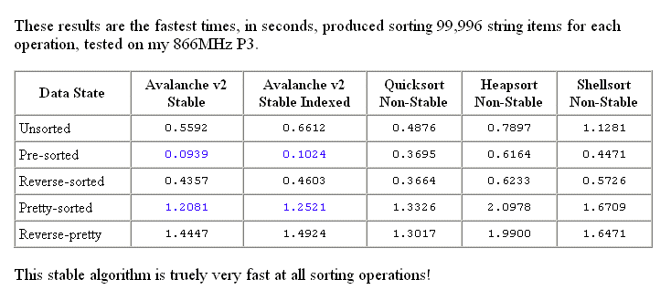

<div align="center">

## Stable QuickSort v2\.3 \- SAFEARRAY Final \(7th March 2009\)


</div>

### Description

Grab hold of your snow boards folks - Rd's stable non-recursive quicksort algorithm the Avalanche just got even faster ...

This is the latest and final version of my non-recursive quicksort based algorithm that has been written from the ground up as a stable alternative to the blindingly fast quicksort ...

It is not quite as fast as the outright fastest non-stable quicksort, but is still very fast as it uses buffers and copymemory and is beaten by none of my other string sorting algorithms except my fastest non-stable quicksort ...

A standard quicksort only moves items that need swapping, while this stable algorithm manipulates all items on every iteration to keep them all in relative positions to one another. This algorithm I have dubbed the Avalanche ...

See included html page in 21k zip for details ...

Also included is an Avalanche based pre-sorter and the latest version of my insert/binary hybrid Twister algorithm which utilizes the pre-sorter ...

Obscure Bug Fix 7 March 09. I documented it 'can sort sub-sets of the array data' but with the indexed version if you do an error *could* occur without this very small change ...

This is definitely the final version of this unique algorithm, I have very much enjoyed developing it. I hope you like it. Happy coding from Rd :)
 
### More Info
 


<span>             |<span>
---                |---
**Submitted On**   |2008-12-20 18:26:48
**By**             |[Rde](https://github.com/Planet-Source-Code/PSCIndex/blob/master/ByAuthor/rde.md)
**Level**          |Intermediate
**User Rating**    |4.9 (89 globes from 18 users)
**Compatibility**  |VB 4\.0 \(32\-bit\), VB 5\.0, VB 6\.0
**Category**       |[String Manipulation](https://github.com/Planet-Source-Code/PSCIndex/blob/master/ByCategory/string-manipulation__1-5.md)
**World**          |[Visual Basic](https://github.com/Planet-Source-Code/PSCIndex/blob/master/ByWorld/visual-basic.md)
**Archive File**   |[Stable\_Qui214613372009\.zip](https://github.com/Planet-Source-Code/rde-stable-quicksort-v2-3-safearray-final-7th-march-2009__1-63941/archive/master.zip)

### API Declarations

```
CopyMemory API
'
' The Avalanche algorithm has the
' following features:
'
' It can handle sorting arrays
' of millions of string items.
'
' It can handle sorting in
' ascending and descending order.
'
' It can handle case-sensitive
' and case-insensitive criteria.
'
' It can handle zero or higher
' based arrays.
'
' It can handle negative lb and
' positive ub.
'
' It can handle negative lb and
' zero or negative ub.
'
' It can sort sub-sets of the
' array data.
'
```


